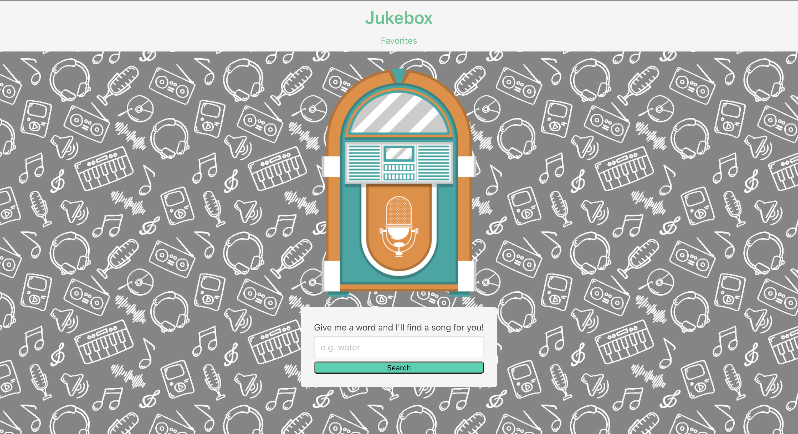
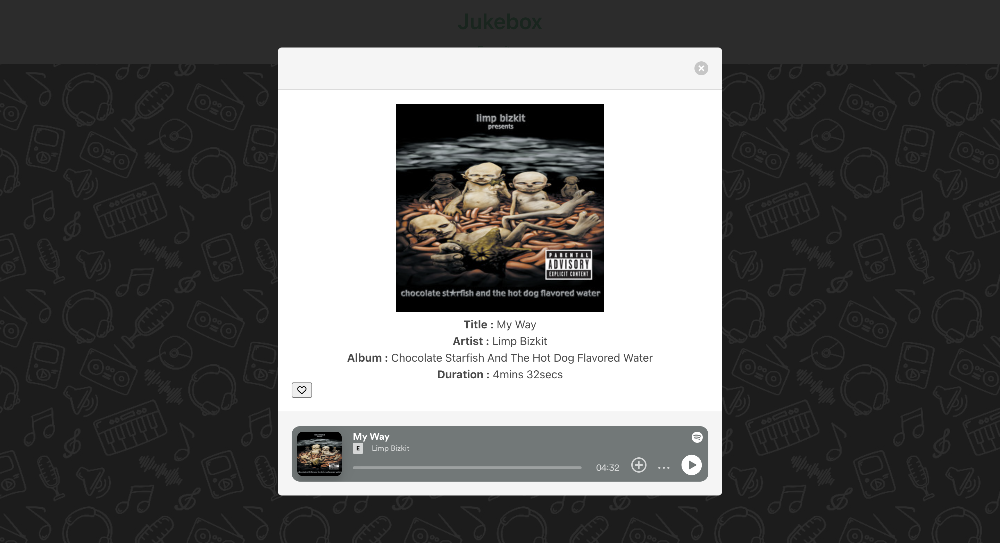

## Name 

Juke Box - A Random Track Generator 

## Description

With the overwhelming amount of new music being published on a daily basis, it can become very difficult to seek out the particular sounds, themes, and moods that you are looking for. That is where Jukebox steps in. By entering a phrase, Jukebox will return you a song that matches your input. These songs can then be compiled into your very own favorites library, where you will be able to add, remove, and track songs at your own leisure. 

## Installation 

N/A

## Usage 
Use the following link to access the deployed webpage: 
https://dymoy.github.io/jukebox/

The source code is found in the root directory of the main branch. 

## Server Side APIs 
1. Rapid API: Spotify by Glavier 
- Source: https://rapidapi.com/Glavier/api/spotify23/

2. iFrame API by Spotify for Developers 
- Source: https://developer.spotify.com/documentation/embeds/tutorials/using-the-iframe-api

## Libraries, Frameworks, and Toolkits Used

1. Bulma CSS Framework 
- Bulma was used to style the webpage. 
- Documentation: 

2. Font Awesome 
- Font Awesome icon toolkit was used to for icon representation of "favorite" button 
- Documentation: https://fontawesome.com/docs

3. jQuery
- jQuery library is used to simplify DOM traversal and manipulation
- Documentation: https://jqueryui.com/demos/

## Visuals 

### Screenshot of the landing page 

### Screenshot of a returned track 

### Screenshot of the favorites page 

## Contributors 

Derek Moy (@dymoy)
Hayden Davis (@haydendavis2020)
Phillip Tombe (@Phillip-Tom)

## License 

Please refer to the license in the repo.